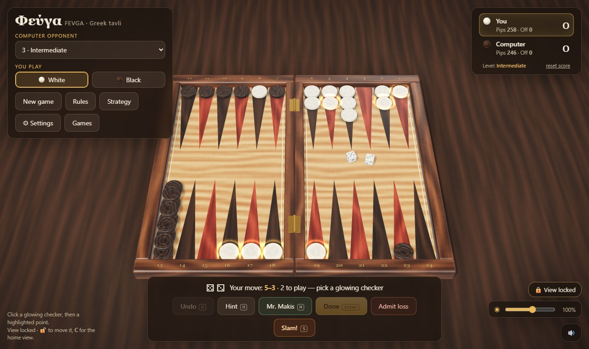

# Fevga (Φεύγα)

A photorealistic 3D game of **Fevga**, the Greek running game of tavli (backgammon), played against the
computer. Five difficulty levels from Beginner to Expert, plus a level-10 coach, **Mr. Makis**, who plays
the best move he can find on your board and explains why.



- **Play in the browser:** <https://fevga.vichos.org>
- **Android:** download `Fevga-<version>.apk` from the [latest release](../../releases/latest) and open it on
  your phone (you will be asked to allow installing apps from your browser or file manager). It runs fully
  offline.

No accounts, no ads, no tracking, no network calls: the game is a static page and everything it remembers
(settings, scores, saved games) stays in your browser or on your phone.

## Features

- Five computer levels, each measured to beat the one below it in self-play, from random play to a two-ply
  expectimax search.
- **Mr. Makis**, the coach: plays his move on your board, explains it from the position (new points, the
  wall, the runner, the race) and shows the next two candidates with win estimates from play-outs.
- **Mistake review**: after a game, Mr. Makis finds your costliest moves (every move scored two rolls
  deep, the doubtful ones played out to the end) and shows each one in replay: the position, your move,
  and his move as a what-if, with the win chance each one gives.
- **Puzzles**: "find the best move" positions from computer games, each with an answer Mr. Makis proved
  by playing every candidate to the end hundreds of times (the right move wins at least 10 points of win
  chance more than the best wrong one). Graded Easy to Master by which computer level already finds the
  move.
- **Hint**, **Undo**, an optional **opening throw**, **match to 5**, and **auto-end turn**.
- **Game records:** the last five games are kept automatically, up to ten named saves, move-by-move
  **replay**, and `.vbg` files to share a game (every move of an imported file is re-checked by the rules
  engine).
- Ten board styles (woods and marbles), a room dimmer, a retro hanging lamp, free or locked camera,
  point numbers, an optional **round counter**, and favourite setups you can save and export (`.vbs`).
- **Strategy guide** (English and Greek) built from thousands of computer-vs-computer games: where to build,
  the runner, the wall, staying mobile, mars. Every figure states the sample it came from.
- And, for the bad days, **Slam!**: fold the board shut with a bang. The game carries on exactly where it was.

## Rules as implemented

- 15 checkers each, all starting on one point; both sides move the same way round the board. No hitting:
  a single checker owns a point.
- **Runner rule:** until your first checker has passed the opponent's starting point, only that checker
  may move.
- Six or more points in a row are allowed anywhere except your own starting quarter: you may never hold
  all six points of it at once.
- **Unblocking:** if every opponent checker on the board is stuck on the single point right behind your
  six in a row, your move must open one of those points (playing as many dice as possible comes first).
- Play both dice if you can (four moves on doubles); if only one can be played, the larger. Bear off
  exactly, or with a higher die from your highest point.
- A win is 1 point; **mars** (the loser has borne off nothing) is 2. You may concede a single or a double
  loss; a double is no longer offered once you have a checker off.

`src/engine.js` is the authority: its header lists the rules, and `test/rules.mjs` checks them.

## Run it locally

The game has no build step. Serve the folder over HTTP (ES modules and the AI web worker do not load from
`file://`):

```bash
python serve.py          # http://127.0.0.1:8831, with caching disabled for development
```

Any static server works too, e.g. `python -m http.server 8831`.

## Tests

```bash
node test/rules.mjs                         # rules engine, random full games, file formats (instant)
node test/strategy-check.mjs                # the strategy guide's claims vs the engine (instant)
node test/selfplay.mjs 200 1-2 2-3 3-4 4-5  # each level against the one below
node test/makis.mjs 40 120                  # Mr. Makis against the Expert (slow: ~1 min a game)
node test/make-puzzles.mjs 8 8 150 40       # regenerate src/puzzles.js (worker threads, ~40 min)
node test/strategy-stats.mjs 3000 4         # the figures quoted in the strategy guide
```

## Project layout

| Path | What |
|---|---|
| `index.html` | Page shell, HUD, sheets, styles; the import map points `three` at `vendor/`. |
| `src/engine.js` | Pure rules and AI (no DOM): legality, the interactive turn API, full-turn enumeration, evaluation, the five levels and Mr. Makis's analysis. |
| `src/ai-worker.js` | Runs the computer's choice and Mr. Makis off the main thread. |
| `src/main.js` | Renderer, board and checker geometry, animation, input, turn flow, HUD, settings. |
| `src/records.js` | Game records, move notation, `.vbg` / `.vbs` file formats with validated import. |
| `src/textures.js`, `src/themes.js` | Procedural wood and marble textures; the ten board styles. |
| `src/sound.js` | Synthesised sounds (no audio files). |
| `strategy.html` | The strategy guide (standalone page, English and Greek). |
| `vendor/` | three.js r170 and three of its example modules (see `THIRD-PARTY-NOTICES.md`). |
| `app/` | Capacitor wrapper that packages the game as an Android app. |
| `test/` | Rules tests, self-play matches, the evaluation tuner and the guide's statistics. |

## Build the Android app

Requirements: Node 18+, JDK 21 and the Android SDK (platform 35, build-tools 35).

```bash
cd app
npm install
node sync-web.mjs              # copies index.html, strategy.html, src/ and vendor/ into app/www
npx cap add android            # first time only; afterwards: npx cap sync android
node make-icons.mjs            # draws the launcher icons and splash into the Android project
cd android
./gradlew assembleDebug        # -> app/build/outputs/apk/debug/app-debug.apk
```

In the app the strategy guide opens as a full-screen sheet over the game, and file **exports** are not
available (Android's WebView does not download files); importing `.vbg` / `.vbs` files works.

## Licence

[MIT](LICENSE). three.js is MIT-licensed as well; see [THIRD-PARTY-NOTICES.md](THIRD-PARTY-NOTICES.md).
